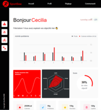

# OpenClassRooms - SportSee - Project-12

 

 

  
  

- **Description**: The images above show the dashboards for Karl and Cecilia.

## Technologies and Languages Used

This project utilizes a range of technologies and programming languages to achieve its functionality:

- **JavaScript**: Used for client-side scripting and interaction logic.
- **React**: A JavaScript library for building user interfaces, used for handling the view layer.
- **CSS Module**: Used for styling the web pages.
- **Node.js**: Server-side JavaScript runtime environment used to run the web server and handle backend logic.
- **D3.js**: A JavaScript library for producing dynamic, interactive data visualizations in web browsers. Used extensively for rendering complex data graphs and charts.

These technologies were chosen for their performance, ease of use, and community support.

  
  
  
  
  

 

----
  
- **JSDoc** is used for this project
----

## 1. General information

To start this project, you are free to use Docker or not. In this documentation, we will see several methods to launch the project easily.

## 2. Project (**without Docker**)

### 2.1 Prerequisites

- [NodeJS (**version 12.18**)](https://nodejs.org/en/)
- [Yarn](https://yarnpkg.com/)

If you are working with several versions of NodeJS, we recommend you install [nvm](https://github.com/nvm-sh/nvm). This tool will allow you to easily manage your NodeJS versions.

### 2.2 Launching the project

- Fork the repository
- Clone it on your computer.
- The `yarn` command will allow you to install the dependencies.
- The `yarn dev` command will allow you to run the micro API.

## 3. Project (**with Docker**)

### 2.1 Prerequisites

- [Docker Desktop](https://www.docker.com/products/docker-desktop)

### 2.2 Starting the project

- The `docker image build --no-cache -t micro-api .` command will allow you to build your image.
- The `docker container run --name micro-api -p 3000:3000 -dt micro-api yarn` command will allow you to create your Docker container and run your image on port 3000.
- The `docker container stop micro-api` command will allow you to stop your micro-api.
- The `docker container rm micro-api` command will allow you to delete your micro-api container.

### 2.3 Vscode and container remotes

Finally, if you have VsCode, you can easily launch your project in a docker environment.

You will need the [Remote Development extension](https://marketplace.visualstudio.com/items?itemName=ms-vscode-remote.vscode-remote-extensionpack). Once you have this extension installed, just click on the `Reopen in Container` button.

Once in the container, run the `yarn dev` command.

## 4. Endpoints

### 4.1 Possible endpoints

This project includes four endpoints that you will be able to use: 

- `http://localhost:3000/user/${userId}` - retrieves information from a user. This first endpoint includes the user id, user information (first name, last name and age), the current day's score (todayScore) and key data (calorie, macronutrient, etc.).
- `http://localhost:3000/user/${userId}/activity` - retrieves a user's activity day by day with kilograms and calories.
- `http://localhost:3000/user/${userId}/average-sessions` - retrieves the average sessions of a user per day. The week starts on Monday.
- `http://localhost:3000/user/${userId}/performance` - retrieves a user's performance (energy, endurance, etc.).

**Warning, currently only two users have been mocked. They have userId 12 and 18 respectively.**

----

## 5. Installation - Frontend
Clone the project  
`https://github.com/olivertoussaint/SportSee-P12_OC.git`

Go to the project directory 
`cd sportsee`

Install dependencies 
`npm install`

Start the server  
`npm start`

If you see the following message  
Would you like to run the app on another port instead ? › (Y/n) 
`Press Y to say Yes`

----